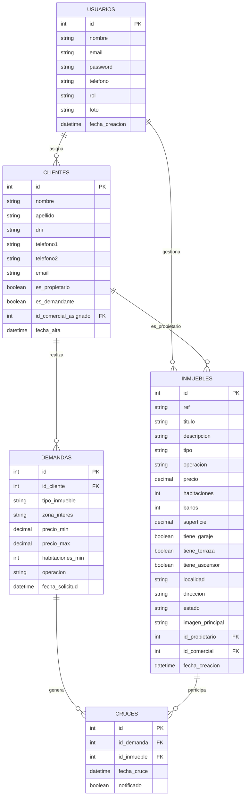

# 🗄️ Documentación Técnica – Diseño de Base de Datos  
**Proyecto:** Portal Inmobiliario  
**Fecha de actualización:** 20 de noviembre de 2025  
**Motor:** MySQL / MariaDB (InnoDB)

---

## 1. 🎯 Objetivos de la Base de Datos

La base de datos **inmobiliaria_db** se ha diseñado para soportar las operaciones principales de una agencia inmobiliaria moderna, priorizando:

### ✔ Gestión del inventario
- Registro detallado de propiedades, precios, características y estado comercial.

### ✔ Gestión unificada de clientes
- Un solo registro para cada persona (comprador y vendedor), evitando duplicados.

### ✔ Seguridad operativa
- Uso de claves foráneas con reglas de negocio `ON DELETE` para evitar pérdidas de información accidental.

### ✔ Automatización futura
- Preparada para mecanismos de matching automático entre demandas y propiedades.

---

## 2. 🧩 Decisiones de Diseño Importantes

### A. Unificación de Clientes (`es_propietario`, `es_demandante`)

En lugar de dos tablas separadas, se utiliza una sola tabla `clientes`, con flags que definen el rol del cliente.

**Motivación empresarial:**  
Un cliente puede vender una propiedad y simultáneamente estar buscando comprar otra.

**Resultado técnico:**  
Evita duplicación, inconsistencias y consultas innecesariamente complejas.

---

### B. Integridad Referencial “Defensiva”

Reglas aplicadas mediante `FOREIGN KEY`:

| Relación                        | Acción             | Motivo                                                   |
|---------------------------------|--------------------|----------------------------------------------------------|
| cliente → inmuebles             | `ON DELETE RESTRICT` | Impide borrar un propietario con inmuebles activos       |
| comercial → inmuebles/clientes  | `ON DELETE SET NULL` | Si un comercial se va, no se pierde el histórico         |
| cliente → demandas              | `ON DELETE CASCADE`  | Limpieza automática de demandas obsoletas                |
| demanda ↔ inmueble (cruces)     | `ON DELETE CASCADE`  | Limpieza de matches antiguos                             |

---

### C. Gestión de Imágenes

- ❌ No se guardan imágenes como BLOB.  
- ✔ Se guardan únicamente rutas relativas: `/public/images/...`

**Ventajas:**
- Consultas más rápidas  
- Backups más ligeros  
- Mejor compatibilidad con CDN futuros

---

## 3. 🏗️ Esquema General (Vista Lógica)

El ecosistema se compone de cinco tablas principales:

- **usuarios** → Personal interno (admin/comerciales)
- **clientes** → Personas externas con rol vendedor/comprador
- **inmuebles** → Propiedades en cartera
- **demandas** → Búsquedas activas de los compradores
- **cruces** → Matriz N:M entre inmuebles y demandas

---

## 4. 📚 Definición de Tablas

### 4.1. Tabla `usuarios`

| Campo   | Tipo         | Descripción                         |
|---------|--------------|-------------------------------------|
| id      | INT PK       | Identificador único                 |
| nombre  | VARCHAR(100) | Nombre completo                     |
| email   | VARCHAR(100) | Correo de acceso (único)            |
| password| VARCHAR(255) | Hash de contraseña                  |
| telefono| VARCHAR(20)  | Teléfono de contacto                |
| rol     | ENUM         | `admin` / `comercial`               |
| foto    | VARCHAR(255) | Ruta de la foto de perfil           |
| fecha_creacion | TIMESTAMP | Alta en el sistema             |

---

### 4.2. Tabla `clientes`

Tabla unificada de vendedores/compradores.

| Campo                | Tipo          | Descripción                                  |
|----------------------|---------------|----------------------------------------------|
| id                   | INT PK        | Identificador                                |
| nombre               | VARCHAR(100)  | Nombre                                       |
| apellido             | VARCHAR(100)  | Apellido                                     |
| dni                  | VARCHAR(20)   | Documento único                              |
| telefono1            | VARCHAR(20)   | Teléfono principal                           |
| telefono2            | VARCHAR(20)   | Teléfono secundario                          |
| email                | VARCHAR(100)  | Correo electrónico                           |
| es_propietario       | TINYINT(1)    | 1 = tiene inmuebles                          |
| es_demandante        | TINYINT(1)    | 1 = busca inmuebles                          |
| id_comercial_asignado| INT FK        | Comercial responsable                        |
| fecha_alta           | TIMESTAMP     | Fecha de alta en el sistema                  |

---

### 4.3. Tabla `inmuebles`

| Campo            | Tipo                    | Descripción                             |
|------------------|-------------------------|-----------------------------------------|
| id               | INT PK                  | Identificador                           |
| ref              | VARCHAR(20) UNIQUE      | Código interno                          |
| titulo           | VARCHAR(150)            | Título comercial                        |
| descripcion      | TEXT                    | Descripción de la propiedad             |
| tipo             | VARCHAR(50)             | Tipo (piso, chalet, local, etc.)       |
| operacion        | ENUM                    | venta, alquiler_larga, etc.            |
| precio           | DECIMAL(12,2)           | Precio                                  |
| habitaciones     | INT                     | Número de habitaciones                  |
| banos            | INT                     | Número de baños                         |
| superficie       | DECIMAL(10,2)           | Metros cuadrados                        |
| tiene_garaje     | TINYINT(1)              | Flag garaje                             |
| tiene_terraza    | TINYINT(1)              | Flag terraza                            |
| tiene_ascensor   | TINYINT(1)              | Flag ascensor                           |
| localidad        | VARCHAR(100)            | Localidad                               |
| direccion        | VARCHAR(200)            | Dirección completa                      |
| estado           | ENUM                    | libre / reservado / vendido             |
| imagen_principal | VARCHAR(255)            | Ruta de imagen principal                |
| id_propietario   | INT FK                  | Referencia a `clientes(id)`             |
| id_comercial     | INT FK                  | Referencia a `usuarios(id)`             |
| fecha_creacion   | TIMESTAMP               | Fecha de alta                           |

---

### 4.4. Tabla `demandas`

| Campo           | Tipo           | Descripción                              |
|-----------------|----------------|------------------------------------------|
| id              | INT PK         | Identificador                            |
| id_cliente      | INT FK         | Cliente demandante                       |
| tipo_inmueble   | VARCHAR(50)    | Tipo de inmueble buscado                 |
| zona_interes    | VARCHAR(100)   | Zona o barrio                            |
| precio_min      | DECIMAL(12,2)  | Precio mínimo                            |
| precio_max      | DECIMAL(12,2)  | Precio máximo                            |
| habitaciones_min| INT            | Habitaciones mínimas                     |
| operacion       | ENUM           | Tipo de operación                        |
| fecha_solicitud | TIMESTAMP      | Fecha de creación de la demanda          |

---

### 4.5. Tabla `cruces`

Relación N:M entre demandas e inmuebles.

| Campo        | Tipo        | Descripción                                |
|--------------|-------------|--------------------------------------------|
| id           | INT PK      | Identificador                              |
| id_demanda   | INT FK      | Referencia a `demandas(id)`                |
| id_inmueble  | INT FK      | Referencia a `inmuebles(id)`               |
| fecha_cruce  | TIMESTAMP   | Fecha en la que se generó el cruce         |
| notificado   | TINYINT(1)  | 1 = el cliente ya ha sido notificado       |

---

## 5. 🧱 Implementación desde PHP (MVC)

- `Database.php` con **PDO + Singleton** para reutilizar la conexión.
- Modelos en `/app/models/`:
  - `Usuario.php`
  - `Cliente.php`
  - `Inmueble.php`
  - `Demanda.php`
  - `Cruce.php`
- Uso de **Prepared Statements** en todas las consultas para mitigar Inyección SQL.
- Controladores en `/app/controllers/` para orquestar lógica de negocio y vistas.

---

## 6. 🗺️ Diagrama ER (ASCII)

```text
+-------------+           +-------------+
|   usuarios  |           |   clientes  |
+-------------+           +-------------+
| id (PK)     |<--+   +-->| id (PK)     |
| nombre      |   |   |   | nombre      |
| email (UQ)  |   |   |   | apellido    |
| password    |   |   |   | dni (UQ)    |
| telefono    |   |   |   | telefono1   |
| rol         |   |   |   | telefono2   |
| foto        |   |   |   | email       |
+-------------+   |   |   | es_propiet. |
                  |   |   | es_demand.  |
                  |   |   | id_comer_asg|--+
                  |   |   | fecha_alta  |  |
                  |   |   +-------------+  |
                  |   |                    |
                  |   |                    |
                  |   |          +-----------------+
                  |   +--------->|   inmuebles     |
                  |              +-----------------+
                  |              | id (PK)         |
                  |              | ref (UQ)        |
                  |              | titulo          |
                  |              | descripcion     |
                  |              | tipo            |
                  |              | operacion       |
                  |              | precio          |
                  |              | habitaciones    |
                  |              | banos           |
                  |              | superficie      |
                  |              | tiene_garaje    |
                  |              | tiene_terraza   |
                  |              | tiene_ascensor  |
                  |              | localidad       |
                  |              | direccion       |
                  |              | estado          |
                  |              | imagen_principal|
                  +--------------| id_propietario  |
                                 | id_comercial    |
                                 | fecha_creacion  |
                                 +--------+--------+
                                          |
                                          |
                                  +-------v--------+
                                  |    demandas    |
                                  +----------------+
                                  | id (PK)        |
                                  | id_cliente (FK)|
                                  | tipo_inmueble  |
                                  | zona_interes   |
                                  | precio_min     |
                                  | precio_max     |
                                  | habitac_min    |
                                  | operacion      |
                                  | fecha_solicitud|
                                  +-------+--------+
                                          |
                                          |
                                  +-------v--------+
                                  |    cruces      |
                                  +----------------+
                                  | id (PK)        |
                                  | id_demanda (FK)|
                                  | id_inmueble(FK)|
                                  | fecha_cruce    |
                                  | notificado     |
                                  +----------------+
```

---

## 7. 📊 Diagrama ER en Mermaid

Puedes pegar este bloque directamente en herramientas como **Mermaid Live Editor**, **Obsidian**, **VS Code con extensión Mermaid**, o GitHub (en issues / wikis).



---

## 8. 🧾 Script SQL Completo (Creación de Estructura)

```sql
SET NAMES utf8mb4;
SET FOREIGN_KEY_CHECKS = 0;

-- -----------------------------------------------------
-- 1. TABLA DE USUARIOS (Administradores y Comerciales)
-- -----------------------------------------------------
DROP TABLE IF EXISTS `usuarios`;
CREATE TABLE `usuarios` (
  `id` int(11) NOT NULL AUTO_INCREMENT,
  `nombre` varchar(100) NOT NULL,
  `email` varchar(100) NOT NULL,
  `password` varchar(255) NOT NULL,
  `telefono` varchar(20) DEFAULT NULL,
  `rol` enum('admin','comercial') DEFAULT 'comercial',
  `foto` varchar(255) DEFAULT NULL,
  `fecha_creacion` timestamp NOT NULL DEFAULT current_timestamp(),
  PRIMARY KEY (`id`),
  UNIQUE KEY `email` (`email`)
) ENGINE=InnoDB DEFAULT CHARSET=utf8mb4;

INSERT INTO `usuarios` (`nombre`, `email`, `password`, `rol`) 
VALUES ('Coordinador General', 'admin@inmobiliaria.loc', 'admin123', 'admin');


-- -----------------------------------------------------
-- 2. TABLA DE CLIENTES
-- -----------------------------------------------------
DROP TABLE IF EXISTS `clientes`;
CREATE TABLE `clientes` (
  `id` int(11) NOT NULL AUTO_INCREMENT,
  `nombre` varchar(100) NOT NULL,
  `apellido` varchar(100) DEFAULT NULL,
  `dni` varchar(20) NOT NULL,
  `telefono1` varchar(20) NOT NULL,
  `telefono2` varchar(20) DEFAULT NULL,
  `email` varchar(100) DEFAULT NULL,
  `es_propietario` tinyint(1) DEFAULT 0,
  `es_demandante` tinyint(1) DEFAULT 1,
  `id_comercial_asignado` int(11) DEFAULT NULL,
  `fecha_alta` timestamp NOT NULL DEFAULT current_timestamp(),
  PRIMARY KEY (`id`),
  UNIQUE KEY `dni` (`dni`),
  KEY `id_comercial_asignado` (`id_comercial_asignado`),
  CONSTRAINT `clientes_ibfk_1` FOREIGN KEY (`id_comercial_asignado`) REFERENCES `usuarios` (`id`) ON DELETE SET NULL
) ENGINE=InnoDB DEFAULT CHARSET=utf8mb4;


-- -----------------------------------------------------
-- 3. TABLA DE INMUEBLES
-- -----------------------------------------------------
DROP TABLE IF EXISTS `inmuebles`;
CREATE TABLE `inmuebles` (
  `id` int(11) NOT NULL AUTO_INCREMENT,
  `ref` varchar(20) DEFAULT NULL,
  `titulo` varchar(150) NOT NULL,
  `descripcion` text DEFAULT NULL,
  `tipo` varchar(50) DEFAULT NULL,
  `operacion` enum('venta','alquiler_larga','alquiler_corta','vacacional') NOT NULL,
  `precio` decimal(12,2) NOT NULL,
  `habitaciones` int(11) DEFAULT 0,
  `banos` int(11) DEFAULT 0,
  `superficie` decimal(10,2) DEFAULT NULL,
  `tiene_garaje` tinyint(1) DEFAULT 0,
  `tiene_terraza` tinyint(1) DEFAULT 0,
  `tiene_ascensor` tinyint(1) DEFAULT 0,
  `localidad` varchar(100) DEFAULT NULL,
  `direccion` varchar(200) DEFAULT NULL,
  `estado` enum('libre','reservado','vendido') DEFAULT 'libre',
  `imagen_principal` varchar(255) DEFAULT NULL,
  `id_propietario` int(11) NOT NULL,
  `id_comercial` int(11) DEFAULT NULL,
  `fecha_creacion` timestamp NOT NULL DEFAULT current_timestamp(),
  PRIMARY KEY (`id`),
  UNIQUE KEY `ref` (`ref`),
  KEY `id_propietario` (`id_propietario`),
  KEY `id_comercial` (`id_comercial`),
  CONSTRAINT `inmuebles_ibfk_1` FOREIGN KEY (`id_propietario`) REFERENCES `clientes` (`id`) ON DELETE RESTRICT,
  CONSTRAINT `inmuebles_ibfk_2` FOREIGN KEY (`id_comercial`) REFERENCES `usuarios` (`id`) ON DELETE SET NULL
) ENGINE=InnoDB DEFAULT CHARSET=utf8mb4;


-- -----------------------------------------------------
-- 4. TABLA DE DEMANDAS
-- -----------------------------------------------------
DROP TABLE IF EXISTS `demandas`;
CREATE TABLE `demandas` (
  `id` int(11) NOT NULL AUTO_INCREMENT,
  `id_cliente` int(11) NOT NULL,
  `tipo_inmueble` varchar(50) DEFAULT NULL,
  `zona_interes` varchar(100) DEFAULT NULL,
  `precio_min` decimal(12,2) DEFAULT NULL,
  `precio_max` decimal(12,2) DEFAULT NULL,
  `habitaciones_min` int(11) DEFAULT 1,
  `operacion` enum('venta','alquiler_larga','alquiler_corta','vacacional') DEFAULT NULL,
  `fecha_solicitud` timestamp NOT NULL DEFAULT current_timestamp(),
  PRIMARY KEY (`id`),
  KEY `id_cliente` (`id_cliente`),
  CONSTRAINT `demandas_ibfk_1` FOREIGN KEY (`id_cliente`) REFERENCES `clientes` (`id`) ON DELETE CASCADE
) ENGINE=InnoDB DEFAULT CHARSET=utf8mb4;


-- -----------------------------------------------------
-- 5. TABLA DE CRUCES
-- -----------------------------------------------------
DROP TABLE IF EXISTS `cruces`;
CREATE TABLE `cruces` (
  `id` int(11) NOT NULL AUTO_INCREMENT,
  `id_demanda` int(11) NOT NULL,
  `id_inmueble` int(11) NOT NULL,
  `fecha_cruce` timestamp NOT NULL DEFAULT current_timestamp(),
  `notificado` tinyint(1) DEFAULT 0,
  PRIMARY KEY (`id`),
  KEY `id_demanda` (`id_demanda`),
  KEY `id_inmueble` (`id_inmueble`),
  CONSTRAINT `cruces_ibfk_1` FOREIGN KEY (`id_demanda`) REFERENCES `demandas` (`id`) ON DELETE CASCADE,
  CONSTRAINT `cruces_ibfk_2` FOREIGN KEY (`id_inmueble`) REFERENCES `inmuebles` (`id`) ON DELETE CASCADE
) ENGINE=InnoDB DEFAULT CHARSET=utf8mb4;

SET FOREIGN_KEY_CHECKS = 1;
```

---

Fin de la documentación.
