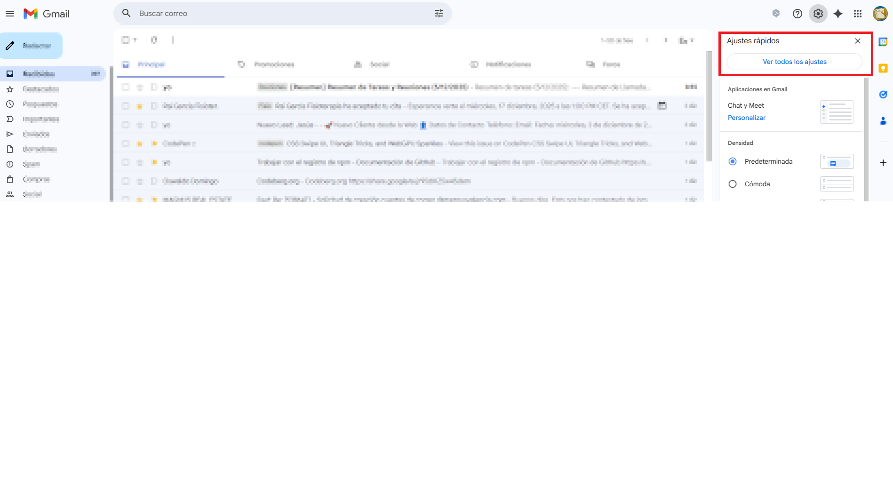
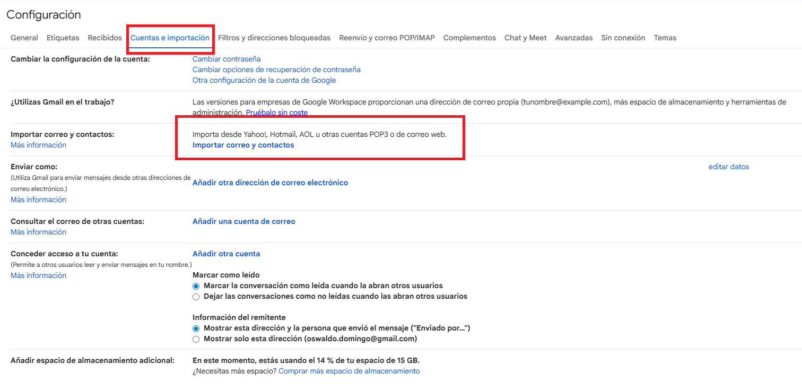
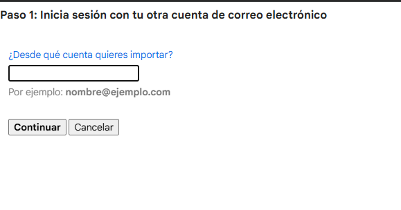
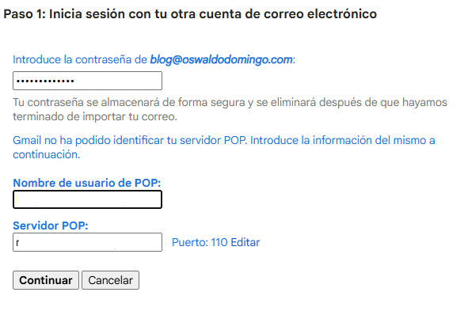
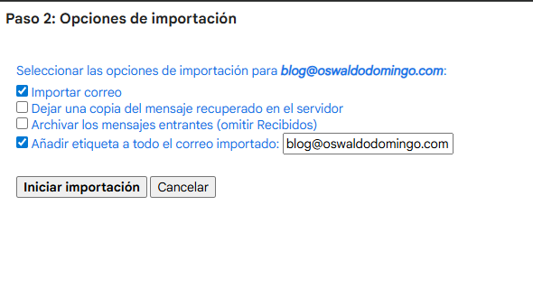
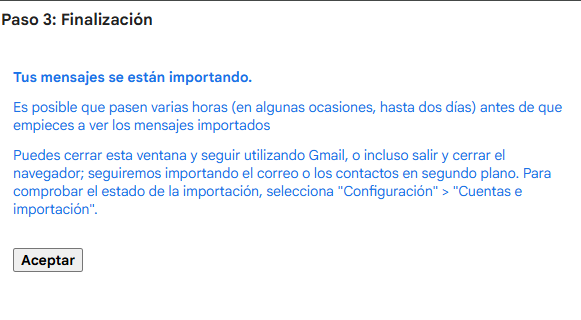

# Documentación: Configuración de importación de correo corporativo en Gmail (POP3)

Esta documentación explica cómo configurar una cuenta de correo corporativa
(por ejemplo `unCorreo@unDominio.com`, actualmente accesible vía Roundcube)
dentro de una cuenta de Gmail (`unCorreoGmail@gmail.com`) usando **POP3**,
de forma que:

- Gmail actúe como **almacén principal** de los correos.
- El servidor del hosting se pueda **vaciar** para no quedarse sin espacio.
- El usuario pueda seguir **enviando y respondiendo** con su dirección
  corporativa.

---

## 1. Decisión crítica: IMAP vs POP3

Antes de hacer ningún cambio es imprescindible decidir **cómo** se conectará
Gmail al buzón corporativo. Las dos opciones estándar son **IMAP** y **POP3**
y el comportamiento de cada una es muy distinto.

### 1.1. IMAP – “Espejo sincronizado”

IMAP funciona como un **espejo** del servidor de correo:

- Los mensajes viven principalmente en el **servidor del hosting**.
- Gmail, Roundcube, el móvil, etc. solo muestran una copia sincronizada.
- Si se borra un mensaje en Gmail, **se borra también en el servidor** y
  desaparece del resto de dispositivos.
- Si el servidor se queda sin espacio, **IMAP no soluciona el problema**:
  aunque los correos se vean desde Gmail, seguirán ocupando espacio en el
  servidor.

**Conclusión para este proyecto (espacio limitado en el servidor):**  
IMAP **no es adecuado** si el objetivo es liberar espacio. El buzón del
hosting se seguiría llenando.

### 1.2. POP3 – “Descarga y archivo”

POP3 funciona como un sistema de **descarga y archivo**:

- Gmail se conecta periódicamente al servidor corporativo mediante POP3.
- **Descarga** los mensajes almacenados en el servidor.
- Según la configuración, puede **borrar** esos mensajes del servidor después
  de descargarlos.

Opciones clave:

- Si se **deja copia en el servidor**:  
  Gmail obtiene una copia, pero el mensaje **permanece** en el servidor y el
  buzón continúa llenándose.
- Si **no se deja copia**:  
  cuando Gmail descarga un mensaje, indica al servidor que lo **elimine**.
  El buzón del hosting se va **vaciando** y los mensajes pasan a estar solo
  en Gmail.

**Conclusión para este caso (usar Gmail como almacén):**  
POP3 es la opción adecuada para que **Gmail sea el repositorio principal**
y el servidor de hosting se mantenga con espacio libre.

### 1.3. Resumen de la elección

En este proyecto se decide:

- Usar **POP3** para la **recepción** de correos corporativos en Gmail.
- Tras una breve fase de pruebas, configurar POP3 **sin dejar copia en el
  servidor** para liberar espacio.
- Configurar Gmail para que los **envíos** se realicen a través del servidor
  **SMTP corporativo**, de modo que el remitente siga siendo la dirección
  corporativa (`unCorreo@unDominio.com`).

### 1.4. Tabla comparativa IMAP vs POP3

| Aspecto                        | IMAP (sincronización / espejo)                                    | POP3 (descarga / archivo)                                                                 |
|-------------------------------|--------------------------------------------------------------------|-------------------------------------------------------------------------------------------|
| Dónde viven los correos       | Principalmente en el **servidor**                                 | Principalmente en **Gmail** (una vez descargados)                                        |
| Espacio en el servidor        | Se **llena** igualmente, aunque se use Gmail                      | Se puede **liberar espacio** borrando del servidor tras la descarga                      |
| Borrado de correos            | Borrar en un sitio = borrar en todos los dispositivos             | Depende de la configuración (“dejar copia” o no)                                         |
| Uso en varios dispositivos    | Muy cómodo (todos ven la misma bandeja)                           | Cada cliente POP3 gestiona su propia copia                                               |
| Recomendado para este caso    | ❌ No, no resuelve el problema de espacio                         | ✅ Sí, permite usar Gmail como almacén y vaciar el buzón del servidor                    |
| Riesgo principal              | Borrados accidentales sincronizados                              | Si no se deja copia, los correos solo quedarán en Gmail una vez descargados              |

---

## 2. Preparación: datos necesarios del hosting

Antes de configurar Gmail hay que recopilar ciertos datos técnicos del
proveedor de hosting (el que ofrece Roundcube). Suelen encontrarse en el
panel de control, en secciones como **“Configuración del cliente de correo”**
o **“Mail settings”**.

### 2.1. Datos básicos de la cuenta

- **Dirección de correo corporativa**  
  Ejemplo: `unCorreo@unDominio.com`

- **Nombre de usuario de la cuenta**  
  Habitualmente coincide con la dirección completa:  
  `unCorreo@unDominio.com`

- **Contraseña**  
  La misma que se utiliza para acceder a Roundcube.  
  (Si se ha olvidado, normalmente se puede restablecer desde el panel).

### 2.2. Datos del servidor entrante (POP3)

- **Servidor POP3 (entrante)**  
  Ejemplos típicos (usar los reales del hosting):  
  - `mail.tudominio.com`  
  - `pop.tudominio.com`

- **Puerto POP3**  
  - Con **SSL/TLS** suele ser **995**.  
  - Sin cifrado suele ser **110**.  
  En la documentación se recomendará usar SSL cuando el proveedor lo ofrezca.

- **Seguridad**  
  - **SSL/TLS** (recomendado) o sin cifrado, según el proveedor.

### 2.3. Datos del servidor saliente (SMTP)

- **Servidor SMTP (saliente)**  
  Ejemplos:  
  - `mail.tudominio.com`  
  - `smtp.tudominio.com`

- **Puerto SMTP**  
  - `587` con **TLS/STARTTLS**, o  
  - `465` con **SSL**, según indique el hosting.

- **Seguridad**  
  - TLS/STARTTLS o SSL.

- **Autenticación**  
  - Se requiere autenticación con el mismo usuario y contraseña del buzón
    (`unCorreo@unDominio.com`).

---

## 3. Configuración de la **recepción** en Gmail mediante POP3

El objetivo de esta sección es que Gmail **importe** los correos del buzón
corporativo usando POP3.

> Recomendación de trabajo: realizar primero una prueba dejando copia en el
> servidor y, una vez verificado que todo funciona, desactivar esa opción
> para empezar a liberar espacio.

### 3.1. Acceso a la configuración de Gmail

1. Entrar en Gmail:  
   `https://mail.google.com`
2. Hacer clic en el icono de **engranaje** (Ajustes) en la esquina superior
   derecha.
3. En el panel lateral que se abre (**Ajustes rápidos**), pulsar en  
   **“Ver todos los ajustes”**.

### 3.2. Ir a la pestaña “Cuentas e importación”

1. En la parte superior de la pantalla de configuración, seleccionar la
   pestaña **“Cuentas e importación”**.
2. Dentro de esta pestaña existen dos secciones relevantes:
   - **“Importar correo y contactos”**, que abre un asistente de importación.
   - **“Consultar el correo de otras cuentas (mediante POP3)”**, donde se
     muestra el estado de las cuentas POP3 configuradas.

En este documento se ilustra el uso del asistente **“Importar correo y
contactos”**, que finalmente deja configurada la cuenta como POP3 en el
apartado “Consultar el correo de otras cuentas”. Ambos caminos desembocan en
el mismo resultado técnico: una cuenta POP3 configurada en Gmail.

### 3.3. Paso 1 del asistente: indicar la cuenta a importar

1. En el apartado **“Importar correo y contactos”**, hacer clic en  
   **“Importar correo y contactos”**.
2. Se abre una ventana del asistente. En el campo  
   **“¿Desde qué cuenta quieres importar?”**, escribir la dirección
   corporativa completa, por ejemplo:  
   `unCorreo@unDominio.com`.
3. Pulsar **“Continuar”**.

### 3.4. Paso 1 (continuación): datos de POP3

En algunos casos Gmail no detecta automáticamente la configuración del
servidor y pedirá introducir los datos de POP3:

- **Nombre de usuario de POP**:  
  normalmente la dirección completa, por ejemplo `unCorreo@unDominio.com`.
- **Servidor POP**:  
  por ejemplo `mail.tudominio.com` (según datos del hosting).
- **Puerto**:  
  el asistente puede proponer **110** (sin cifrado).  
  Si el proveedor ofrece conexión segura, es preferible usar **995** con SSL.

Introducir estos datos según la información del hosting y pulsar
**“Continuar”**.

### 3.5. Paso 2: opciones de importación

En el **Paso 2** el asistente muestra varias opciones para la importación:

- **Importar correo**  
  Debe estar marcada para que Gmail descargue los mensajes.
- **Dejar una copia del mensaje recuperado en el servidor**  
  - Si está **marcada**: el servidor conservará los mensajes (el buzón se
    seguirá llenando).
  - Si está **desmarcada**: una vez importados, los mensajes se **eliminan
    del servidor**, liberando espacio.
- **Archivar los mensajes entrantes (omitir Recibidos)**  
  Si se marca, los mensajes importados no aparecerán en la bandeja de entrada,
  sino solo en la etiqueta asociada.
- **Añadir etiqueta a todo el correo importado**  
  Permite identificar fácilmente estos correos en Gmail (por ejemplo, con
  una etiqueta `blog@tudominio.com` o `Corporativo – unCorreo@unDominio.com`).

#### 3.5.1. Opción crítica: “Dejar una copia del mensaje recuperado en el servidor”

Esta casilla es la que determina si el servidor del hosting se vacía o no:

- **Casilla MARCADA**  
  - Gmail descarga los mensajes, pero el servidor mantiene una copia.  
  - El buzón del hosting **se seguirá llenando**.
- **Casilla DESMARCADA**  
  - Tras la descarga, Gmail ordena al servidor **eliminar** los mensajes.  
  - El buzón del hosting se va **vaciando** y el espacio se libera.

**Recomendación para el escenario de espacio limitado:**

1. **Fase de prueba (1–2 días)**  
   - Mantener la casilla **MARCADA** para comprobar que la importación
     funciona correctamente.
2. **Fase definitiva**  
   - Repetir el asistente o editar la configuración para que la casilla quede
     **DESMARCADA** y así el servidor se vaya vaciando automáticamente.

> Una vez que no se deja copia en el servidor, **Gmail pasa a ser la copia
> principal**. Borrar mensajes en Gmail (y vaciar la papelera) será un borrado
> definitivo; hay que evitar eliminaciones masivas sin revisar.

### 3.6. Paso 3: finalización de la importación

Al finalizar el asistente se muestra un mensaje indicando que los
**mensajes se están importando**. Es normal que la primera importación tarde
desde unos minutos hasta varias horas, dependiendo del volumen de correo.

Una vez cerrado el asistente, en la pestaña **“Cuentas e importación”**
aparecerá la cuenta corporativa en el apartado
**“Consultar el correo de otras cuentas”**, indicando el número de mensajes
obtenidos y la fecha/hora de la última consulta.

---

## 4. Configuración del **envío** desde Gmail con remitente corporativo (SMTP)

Para que el usuario pueda **responder** desde Gmail y que el destinatario vea
como remitente la dirección corporativa (`unCorreo@unDominio.com`), es
necesario configurar el envío a través del servidor SMTP del hosting.

### 4.1. Acceso a “Enviar correo como”

1. En Gmail, ir a **“Ver todos los ajustes”**.
2. Seleccionar la pestaña **“Cuentas e importación”**.
3. Localizar el apartado **“Enviar correo como”**.

(En este documento no se adjunta captura específica de esta sección, pero
se encuentra en la misma pantalla donde aparece “Importar correo y contactos”.)

### 4.2. Añadir la dirección corporativa como remitente

1. Hacer clic en **“Añadir otra dirección de correo electrónico”**.
2. En la ventana emergente, rellenar:
   - **Nombre**: nombre que verán los destinatarios
     (por ejemplo, `Nombre Apellidos` o `Nombre – Empresa`).
   - **Dirección de correo electrónico**: `unCorreo@unDominio.com`.
3. Normalmente se deja marcada la casilla **“Tratar como un alias”**.
4. Pulsar **“Siguiente paso”**.

### 4.3. Configurar el servidor SMTP

En la siguiente pantalla se introducen los datos de envío:

- **Servidor SMTP**: por ejemplo `mail.tudominio.com` o `smtp.tudominio.com`.
- **Puerto**: `587` (TLS/STARTTLS) o `465` (SSL), según el proveedor.
- **Nombre de usuario**: la dirección completa (`unCorreo@unDominio.com`).
- **Contraseña**: la contraseña del buzón corporativo.
- **Seguridad**: seleccionar TLS o SSL conforme a la documentación del hosting.

Tras completar los datos, pulsar **“Añadir cuenta”**.

### 4.4. Verificación de la dirección

Gmail envía un **correo de verificación** a la propia cuenta corporativa.
Como esta ya está siendo importada por POP3:

1. Esperar a que el correo de verificación llegue a la bandeja de Gmail.
2. Abrirlo y:
   - Hacer clic en el enlace de confirmación, o
   - Copiar el código de verificación y pegarlo en la ventana que lo solicita.

Una vez verificada, la dirección `unCorreo@unDominio.com` quedará disponible
como remitente en el apartado **“Enviar correo como”**. Se puede marcar como
**predeterminada** para que todos los nuevos mensajes salgan con esa dirección.

### 4.5. Seleccionar el remitente al redactar

Al pulsar **“Redactar”** en Gmail, en el campo **“De”** (cuando hay varias
direcciones configuradas) se puede elegir:

- La dirección de Gmail (`unCorreoGmail@gmail.com`), o
- La dirección corporativa (`unCorreo@unDominio.com`).

Para que los destinatarios vean siempre el correo corporativo, conviene
configurarlo como remitente predeterminado en “Enviar correo como”.

---

## 5. Buenas prácticas y advertencias finales

- **Borrado de correos**  
  Cuando POP3 está configurado sin dejar copia en el servidor, el hosting
  deja de ser una copia de seguridad. Los mensajes quedarán solo en Gmail.
  Hay que evitar vaciar la papelera o borrar grandes cantidades de correos
  sin revisar.

- **Fase de prueba obligatoria**  
  Antes de desactivar “Dejar una copia del mensaje recuperado en el servidor”,
  es recomendable mantenerla activada uno o dos días y comprobar que Gmail
  importa correctamente todos los mensajes.

- **Espacio en Gmail**  
  Gmail ofrece mucho más espacio que la mayoría de hostings compartidos,
  pero no es infinito. Si se acerca al límite, se pueden eliminar correos
  antiguos con adjuntos pesados o contratar almacenamiento adicional
  (Google One).

- **Cliente principal**  
  Una vez que el servidor deje de guardar copia, Roundcube dejará de mostrar
  muchos mensajes (se habrán eliminado tras la importación). Lo más práctico
  es usar **Gmail como cliente principal**, tanto en web como en móvil.

Con esta configuración se cumple el objetivo del proyecto:

- **Gmail actúa como almacén principal de los correos corporativos.**
- **El servidor de hosting se mantiene con espacio disponible**, evitando
  bloqueos por buzón lleno.
- El usuario puede seguir trabajando con su **dirección corporativa** como
  remitente habitual.
